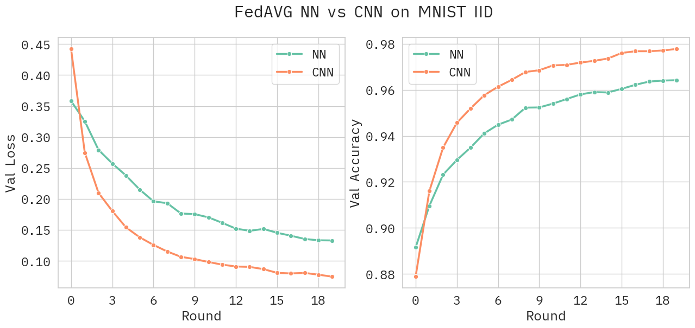

# FedAVG
## A pytorch implementation of Federated Learning from scratch



This repository contains the code for the FedAVG project developed for the course of "Continual Learning" at the University of Pisa.

## Introduction
Federated Learning is a machine learning setting where many clients (e.g. mobile devices or whole organizations) collaboratively train a model under the orchestration of a central server (e.g. service provider), while keeping the training data decentralized. Federated Learning enables a new paradigm for on-device training that minimizes the need for data to leave the device, effectively addressing user privacy concerns and data security.

This project aims to implement the Federated Learning algorithm FedAVG from scratch using Pytorch. The code is based on the paper "Communication-Efficient Learning of Deep Networks from Decentralized Data" by H. Brendan McMahan, et al. [1]

## Installation
To install the required dependencies, run the following command:
```bash
pip install -r requirements.txt
```

## Usage
To run the default experiment, use the following command from the root directory of the project:
```bash
python src/fedsgd.py
```
Alternatively, you can import the `fedSgdPar` function from the `fedsgd.py` file and run it with your own parameters. The function signature is as follows:
```python
result = fedSgdPar(model=Net(), T=20, K=100, C=0.1, E=5, B=10,
                    num_samples=480, lr=0.1, patience=5, weight_decay=10e-5, noiid=False, verbose=True)
```
Where:
- `model` is the neural network model to be trained.
- `T` is the number of communication rounds.
- `K` is the number of clients.
- `C` is the fraction of clients that are sampled per round.
- `E` is the number of local epochs.
- `B` is the local batch size.
- `num_samples` is the number of samples in the dataset.
- `lr` is the learning rate for the local optimizer.
- `patience` is the number of rounds to wait before early stopping.
- `weight_decay` is the L2 regularization parameter.
- `noiid` is a boolean flag that indicates whether the data is non-IID.
- `verbose` is a boolean flag that indicates whether to print the training progress.

## Author
- [Leonardo Stoppani](https://github.com/lilf4p)

## References
- [Communication-Efficient Learning of Deep Networks from Decentralized Data](https://arxiv.org/abs/1602.05629)